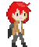

# Hellooo 👋

<!--
**oscar-cbrlc/oscar-cbrlc** is a ✨ _special_ ✨ repository because its `README.md` (this file) appears on your GitHub profile.

Here are some ideas to get you started:

- 🔭 I’m currently working on ...
- 🌱 I’m currently learning ...
- 👯 I’m looking to collaborate on ...
- 🤔 I’m looking for help with ...
- 💬 Ask me about ...
- 📫 How to reach me: ...
- 😄 Pronouns: ...
- ⚡ Fun fact: ...
-->

## I'm a 20 y/o dev who loves tech and programming 💻 <br>
<!--```javascript
aboutMe = {
  from: "Guadalajara, Jalisco, México", 
  graduated: "Technologist in Software Development from Centro de Enseñanza Técnica Industrial", 
  studying: "Studying Computer Engineering at Universidad de Guadalajara"
}
```
-->
- I'm from Guadalajara, México 
- I'm graduated as a Technologist in Software Development from Industrial Technical Education Center (CETI)
- I'm studying Computer Engineering at University of Guadalajara (CUCEI)

## What I've been doing 
- 🎮 I participated in the development of a [game](https://github.com/MichelOrtiz/FinalProject) made with Unity 
- 💪 I'm currently learning fullstack web development<br>

## Languages and Tools
<div align="center">
  &nbsp;
  &nbsp;
  &nbsp;
  &nbsp;
  &nbsp;
  &nbsp;
  &nbsp;
  &nbsp;
  &nbsp;
  &nbsp;
</div>
<!--
## Stats
[](https://github.com/anuraghazra/github-readme-stats)
-->
